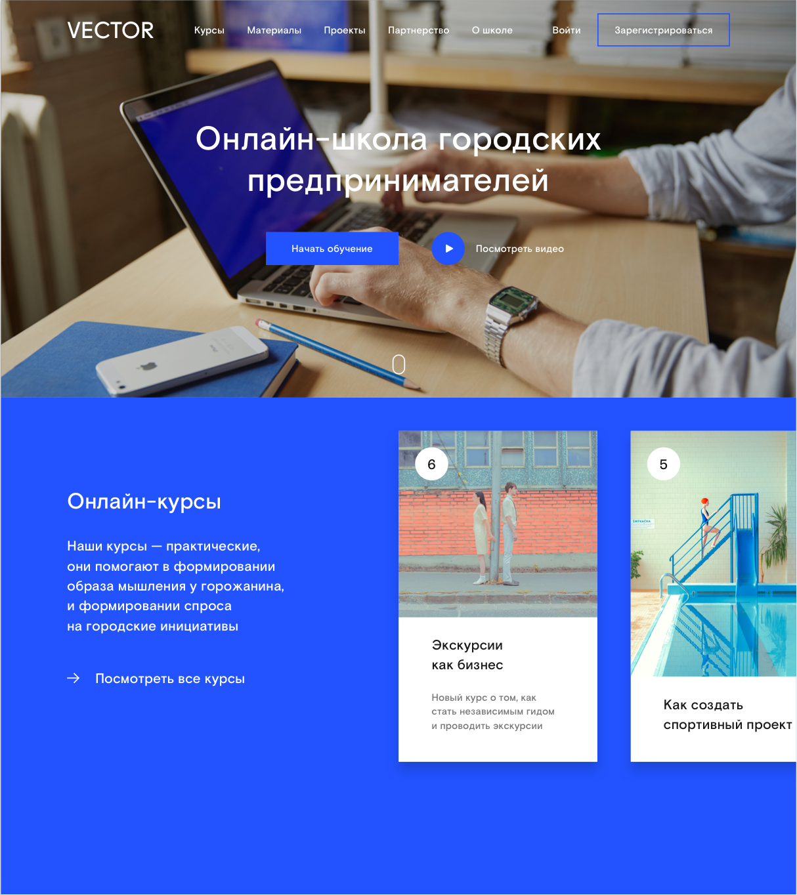
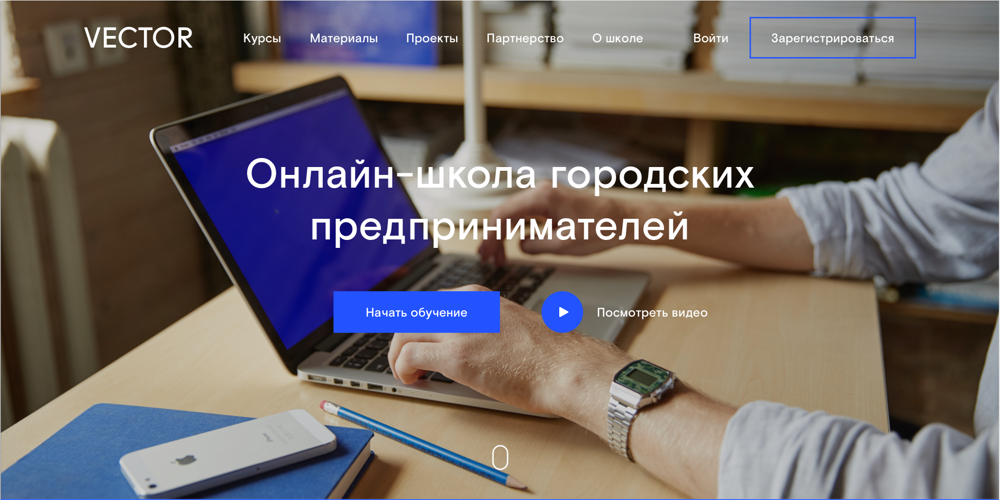
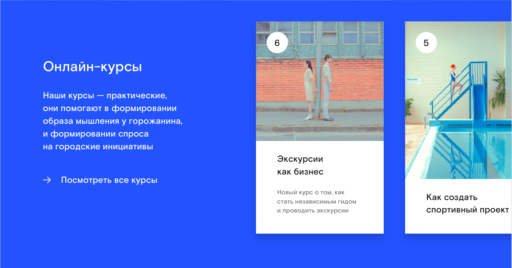

Страница состоит из двух блоков

Первый блок. Главное меню сайта с видео.

1. Состояние главного меню.
Оно должно скрываться наверх при скролле вниз с задержкой в 100 px.
И появляться в виде placeholder при скролле наверх с задержкой 10 px.

2. При клике на кнопку play (видео — https://vimeo.com/170509497).
Главное меню уезжает наверх.
Кнопки в центре экрана уходят в opacity от 100% до 0%.
Картинка уходит в opacity от 100% до 0%.
Видео появляется со scale 110% до 100%, в том же блоке где картинка.
Сверху над видео появляется элемент для закрытия видео.
После закрытия обратные эффекты с теми же параметрами.

Второй блок. Карточки курсов.

1. Ховер у карточки.
При наведении — картинка с заголовком перемещается в маске наверх.
Под заголовком со смещением наверх появляется серый подзаголовок. Можно применить эффект opactity от 0% до 100%.
Также при наведении на карточку увеличивать эффект blur у тени под карточкой в 2 раза.

2. Все курсы. При клике на ссылку «Посмотреть все курсы».
Карточки справа выезжают в левую сторону.
Блок с текстом уходит в opacity от 100% до 0%.
Синий фон растягивается на всю страницу с эффектом scale, закрывая все остальные элементы, кроме карточек.
Сверху, над карточками появляется элемент «Закрыть». После закрытия происходит обратный эффект.
При наведении на последнюю карточку — весь ряд съезжает влево на 2 карточки. Тот же эффект с первой карточкой (все съезжает на 2 карточки вправо).

Верстка должна быть responsive. Решение данной задачи оставляем на ваше усмотрение.
Важно, показать корректную версию работы страницы в разрешении iPhone 6.

По техническим требованиям:

* React* для клиента
* Простой NodeJS сервер, который рендерит страницу на сервере используя React* (не должно быть ошибок рендера, верстка должна переиспользоваться клиентом)
* Придерживаться конкретного код-стайла (+ будет использование / проверка кода при помощи ESLint)

Загрузить код на GitHub
+ ES2015-2017 для JS
+ PostCSS / Stylus / SASS / CSS Modules для стилей
+ Сборка клиента при помощи Webpack
* Можно заменить React, если есть свои предпочтения относительно view библиотеки, на что-нибудь что нравиться больше (например Vue.js, Riot, etc.).
